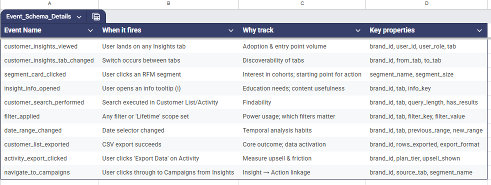

# 🍕 PizzaHub QSR: Retention Analytics & AI Diagnosis

### 📊 Project Overview
**Role:** Product & Data Analyst (Case Study)
**Tools:** Claude AI (Prompt Engineering), Amplitude (Event Instrumentation), Reelo (CRM)
**Context:** Diagnosing a **28% drop in repeat customer orders** for a QSR chain with 45 outlets.

---

### 🧠 Part 1: AI-Powered Diagnosis (Prompt Engineering)
I acted as a Senior Data Analyst to engineer a structured prompt for **Claude AI**, aiming to uncover root causes behind the retention drop.

**Key Prompt Strategy:**
* **Schema Mapping:** Explicitly defined columns (`rfm_segment`, `avg_tbo_in_days`) so the AI understood the data topology.
* **Hypothesis Testing:** Forced the AI to analyze **Breakage Risk** (high points, low visits) and **RFM Transitions** (Loyal → At Risk).
* **Output Constraints:** Demanded specific formats (Sankey Chart logic, ROI tables) for executive reporting.

> 📂 *[View the Full Prompt Logic Here](./prompts/retention_diagnosis_prompt.md)*

---

### 📉 Part 2: Product Analytics Instrumentation (Amplitude)
Designed an Event Schema to track the **"Insight-to-Action"** loop in the Reelo dashboard.

**North Star Metric:** `Insight-Activated Sessions` (Sessions where a user views an insight AND takes action).

**Key Events Tracked:**
| Event Name | Trigger | Business Value |
| :--- | :--- | :--- |
| `campaign_created_from_insight` | User clicks "Create Campaign" from the Insights page | **The "Money Event":** Proves analytics led to revenue. |
| `segment_card_clicked` | User clicks a specific RFM segment | Measures interest in specific cohorts (e.g., "At Risk"). |
| `export_clicked` | User downloads CSV | Signals high-intent analysis ("Power User"). |

---

### 💡 Key Recommendations
1.  **The "At Risk" Automation:** Identified customers with >500 points are churning due to redemption friction. Proposed a "Use it or Lose it" WhatsApp automation.
2.  **Dashboarding:** Designed a **Retention Funnel** in Amplitude to measure drop-off between `customer_insights_viewed` and `campaign_created`.

---

### 👤 Author
**Aayush Raj Giri**
*Product & Data Enthusiast | CSE Student*
https://www.linkedin.com/in/27rajgiri/
